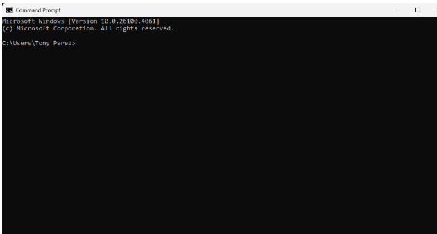

# Setting up Your Computer and Yourself!

In IST356 we teach you programming for data analytics using the tools and techiques used by those in the industry. As such, you will learn how to setup and configure development environments, use git and github and learn to systematically test your code.

This is unlike IST256 where the emphasis is on the programming basics and the motivations behind learning computational thinking.

|| IST356 | IST256|
|-----|-----|-----|
Programming Environment | Install vscode + git + python on your computer | Web-hosted jupyterhub |
Assignment Submissions | Student learn and use git / github | Built-in assignment submission
Coursework, slides, examples | You clone / diff the prof repo | Autodiff and merge at login

In this course you'll do it the real way, nothing is hidden / abstracted away for you.

## Command Prompts

Before we get into installations let us review some basic command prompts. We will be these text instructions in the command line interface. 

### Windows – Command Prompt

How to Open Command Prompt
There are several ways to open it:

Option 1: Using the Start Menu
- Click the Start button.
- Type cmd or Command Prompt.
- Click on the Command Prompt app.

Option 2: Using the Run Dialog
- Press Windows Key + R on your keyboard.
- Type cmd and press Enter

You should see a window like this ...

### macOS - Terminal 

How to Open Terminal
There are two easy ways:

Option 1: Using Spotlight Search
- Press Command + Space on your keyboard.
- Type Terminal and hit **Enter**.

Option 2: Using Finder
- Open Finder.
- Go to Applications > Utilities.
- Double-click on Terminal.

## Step 1: Software Installs

Here's what you'll need to install on your computer. Please read this entire section prior to installing. :-)

NOTE: If you are a MAC user UV will be a better project manager. See https://docs.astral.sh/uv/getting-started/installation/

1. **Visual Studio Code**: https://code.visualstudio.com/Download   
This is a free editor with testing and debugging capabilities. As you install you can accept all defaults, except the last one: DO NOT launch the application when complete! If you do, simply close it. 

2. **Git Source Code Manager**: https://git-scm.com/download/  
As you set it up, you will be asked several questions, for which the default selection is fine. EXCEPTION: choose Visual Studio Code as the default editor. 

3. **Python 3**: https://www.python.org/downloads/  
Do not download the latest recommended Python 3 version. For maximum stability and compatability with other code, you'll want to download the Download the highest security release. As of Fall 2024, that's Python 3.11

See Resources for Setup on Blackboard for more details. I strongly recommend you review. 

## Setup 2: Github Account

Being an SU student comes with some perks. One of them is a Github for Education account and accompanying "packpack" of goodies. To use this benefit, your github account must be associated with your **@syr.edu** email.

### IF YOU HAVE A GITHUB ACCOUNT:

Associate your current account with SU, by adding your email:

1. Go to to https://github.com  and click Sign In 
2. Once you have logged in, go to: https://github.com/settings/emails  
3. Add and verify your SU email address.

### IF YOU DO NOT HAVE A GITHUB ACCOUNT:

You'll need to create an account:

1. Go to to https://github.com  and click Sign In 
2. Follow the on-screen instructions to sign up for an account.
3. Make sure to use your **@syr.edu** email for the account.
4. Add your personal email when you're at it so you don't lose Github access after you graduate!

### Backpack Access

1. Go to the Github Backpack site:  https://education.github.com/pack  
and click **Sign Up For Student Developer Pack**
2. Once your account is verified, you will have backpack access.
3. You'll know its active when you check your billing plan: https://github.com/settings/billing/summary   
you should see a credit here.
4. Once you have backpack access, you can enable Github Copilot AI. https://github.com/settings/copilot 

## Step 3: Configure VS Code

The last step is to configure VS Code for Python debugging. Provided everything else is in order, this should be straightforward.

1. Open Visual studio code. You will be asked to configure it.
    1. Pick a theme: Light, Dark, etc...
    2. Add the following Extensions: Python, Jupyter, Github Copilot
    3. Close the welcome Tab but keep VS Code Open
2. Clone the IST356 master code repository:
    1. Click the "Explorer" Icon in the Activity Bar
    2. Click "Clone Repository" button
    3. In the search bar type mafudge/ist356
3. Check to ensure your environment works.
    1. Open `0-intro/hello.py` run it (menu -> Run -> Start Debuggging) Type your name in the terminal and press ENTER. You should see the output in the terminal and then a `ist356>` prompt.
    2. Open `0-intro/hello.ipynb` notebook file. Run the code cell (click on the cell and press SHIFT+ENTER). Enter your name in the textbox and see the output.
